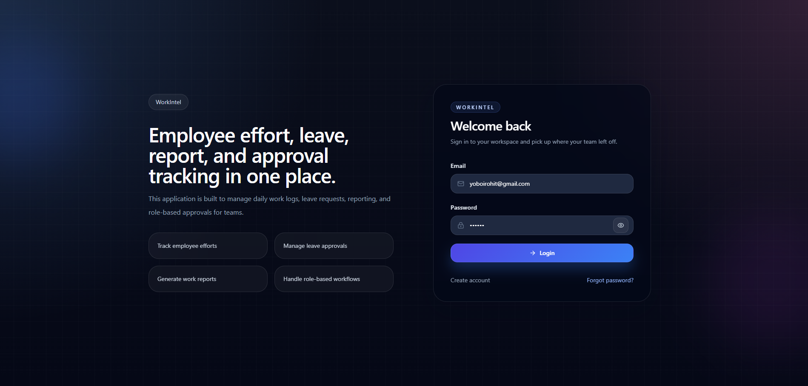
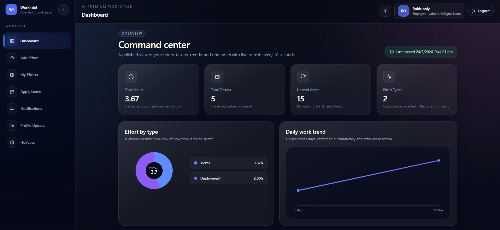

# 🚀 WorkIntel — Employee Productivity & Work Tracking System

WorkIntel is a modern full-stack Employee Productivity Management System built for tracking daily work efforts, leave management, reporting, approvals, notifications, and productivity analytics.

Designed with a premium dark SaaS UI and powered by ASP.NET Core + React.

---

# 🌐 Live Features

✅ JWT Authentication  
✅ Role-Based Access  
✅ Daily Effort Tracking  
✅ Leave Management  
✅ Approval Workflow  
✅ Dashboard Analytics  
✅ Real-time Notifications  
✅ Excel Report Export  
✅ Holiday Management  
✅ Email Reminder System  
✅ Profile Update Requests  
✅ Hangfire Background Jobs  

---

# 👨‍💼 Roles & Permissions

## 👤 Employee

- Add Daily Efforts
- View My Efforts
- Apply Leave
- View Notifications
- Request Profile Update
- Dashboard Analytics

---

## 👨‍💻 Manager

Everything from Employee +

- Approve / Reject Leaves
- View Team Reports
- Export Excel Reports
- Holiday Management

---

## 🛡️ Admin

Everything from Manager +

- User Approval
- Profile Update Approval
- Full System Access

---

# 📊 Dashboard Features

- Total Working Hours
- Ticket Analytics
- Daily Productivity Trends
- Effort Type Distribution
- Notification Center
- Real-time Refresh

---

# 📧 Email Features

- Daily Reminder Emails
- Leave Approval Emails
- Leave Rejection Emails
- Forgot Password Emails
- Holiday Announcement Emails

---

# 🛠️ Tech Stack

## 🔹 Frontend

- React.js
- React Router DOM
- Axios
- Tailwind CSS
- Recharts
- React Hot Toast

---

## 🔹 Backend

- ASP.NET Core Web API
- Entity Framework Core
- SQL Server
- JWT Authentication
- Hangfire

---

# 🔐 Authentication & Security

- JWT Access Tokens
- Role-Based Authorization
- Protected Routes
- API Authorization Policies
- Secure Password Reset Flow

---

# 📸 Screenshots

## 🔐 Login Page



---

## 📊 Dashboard



---

# 📂 Project Structure

## Frontend

```bash
src/
 ├── api/
 ├── components/
 ├── layouts/
 ├── pages/
 ├── routes/
 ├── services/
 └── utils/
```

---

## Backend

```bash
EmployeeProductivitySystem/
 ├── API/
 ├── Application/
 ├── Domain/
 ├── Infrastructure/
```

---

# ⚙️ Installation

# 🔹 Frontend Setup

```bash
npm install
npm start
```

Frontend runs on:

```bash
http://localhost:3000
```

---

# 🔹 Backend Setup

```bash
dotnet restore
dotnet run
```

Backend Swagger:

```bash
https://localhost:5001/swagger
```

---

# 🗄️ Database

Database Used:

```text
SQL Server
```

Update connection string in:

```bash
appsettings.json
```

Run migrations:

```bash
dotnet ef database update
```

---

# 📈 API Modules

## Authentication

- Login
- Register
- Forgot Password
- Reset Password

---

## Effort Management

- Add Effort
- Update Effort
- Delete Effort
- Effort Summary

---

## Leave Management

- Apply Leave
- Approve / Reject Leave

---

## Reports

- Generate Reports
- Export Excel

---

## Notifications

- Reminder Notifications
- Daily Alerts

---

# 🚀 Deployment

## Frontend

- Azure Static Web Apps
- Vercel

---

## Backend

- Azure App Service

---

## Database

- Azure SQL Database

---

# 💡 Future Improvements

- WebSocket Real-time Updates
- Mobile Responsive Enhancements
- Team Analytics
- Attendance Integration
- AI Productivity Insights

---

# 👨‍💻 Developed By

## Rohit Singh

Full Stack Developer  
ASP.NET Core | React.js | SQL Server

GitHub:
https://github.com/Rohit41342

---

# ⭐ Support

If you like this project, give it a ⭐ on GitHub.
